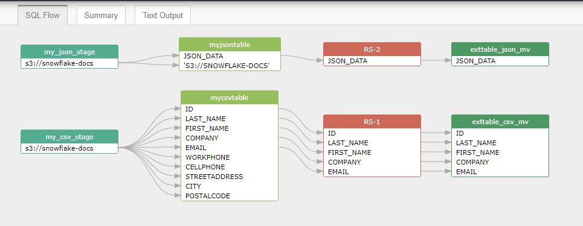

# snowflake-data-lineage
snowflake data lineage discovery using the SQLFlow



[Try SQLFlow Live](https://sqlflow.gudusoft.com/?utm_source=github&utm_medium=text&utm_campaign=snowflake_data_lineage)

## Snowflake data lineage captured from the script used in bulk Loading from Amazon S3 Using COPY

### Script for Creating Required  Objects
```sql
-- Create a database. A database automatically includes a schema named 'public'.

create or replace database mydatabase;

/* Create target tables for CSV and JSON data. The tables are temporary, meaning they persist only for the duration of the user session and are not visible to other users. */

create or replace temporary table mycsvtable (
  id integer,
  last_name string,
  first_name string,
  company string,
  email string,
  workphone string,
  cellphone string,
  streetaddress string,
  city string,
  postalcode string);

create or replace temporary table myjsontable (
  json_data variant);

-- Create a warehouse

create or replace warehouse mywarehouse with
  warehouse_size='X-SMALL'
  auto_suspend = 120
  auto_resume = true
  initially_suspended=true;
```

### Step 1. Create File Format Objects 
```sql
create or replace file format mycsvformat
  type = 'CSV'
  field_delimiter = '|'
  skip_header = 1;
```

### Step 2. Create a Named Stage Object
```sql
create or replace stage my_csv_stage
  file_format = mycsvformat
  url = 's3://snowflake-docs';
```

### Step 3. Copy Data Into the Target Table
```sql
copy into mycsvtable
  from @my_csv_stage/tutorials/dataloading/contacts1.csv
  on_error = 'skip_file';
```

### Step 4. Verify the Loaded Data
```sql
create materialized view exttable_csv_mv
  as
  select ID , LAST_NAME , FIRST_NAME ,COMPANY,EMAIL  from mycsvtable;
```


## Data lineage build for the above SQL script 

my_csv_stage('s3://snowflake-docs',CSV) -> fdd -> mycsvtable -> fdd -> exttable_csv_mv(ID , LAST_NAME , FIRST_NAME ,COMPANY,EMAIL)
> CSV used in mycsvformat is attached to my_csv_stage

[Tutorial: Bulk Loading from Amazon S3 Using COPY](https://docs.snowflake.com/en/user-guide/data-load-external-tutorial.html)
